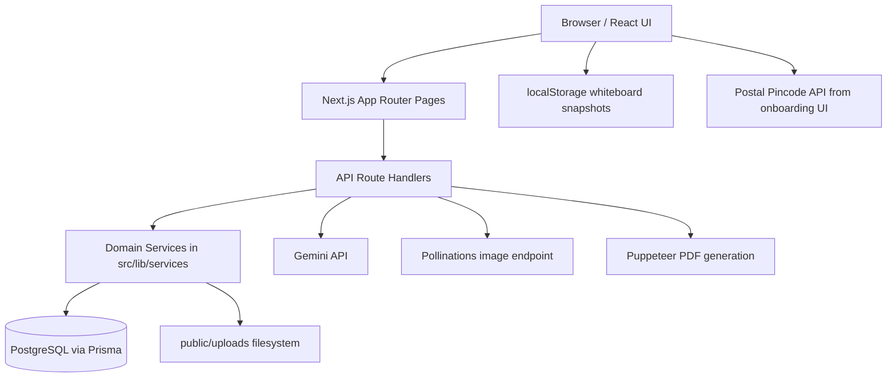
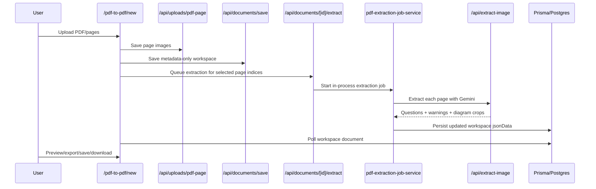

# Nacc-PPT-Maker Project Architecture Guide

## 1. What this project is

This repository is a multi-tenant educational content platform built with Next.js.

At runtime, the product presents itself as **Nexora by Sigma Fusion**, even though the repository folder is named `Nacc-PPT-Maker`.

The application combines:

- institute/workspace management
- role-based authentication and onboarding
- a large **Content Studio** for turning PDFs/images into structured bilingual question sets
- a **PDF generation engine** for slide-like outputs
- a **Library** for storing searchable PDF books
- a **Whiteboard** for annotating/exporting content
- admin and organization management tools
- Gemini-backed AI helpers for extraction, transliteration, answer filling, and question editing

The single most important mental model is this:

> A `PdfDocument` record is not just a generated PDF record. It is the saved workspace state for the full content-processing flow, and the actual PDF is generated on demand from that saved JSON.

---

## 2. Tech stack

### Frontend

- Next.js 14 App Router
- React 18
- Tailwind CSS plus a large custom global stylesheet in `src/app/globals.css`
- Client-heavy pages for the studio, whiteboard, dashboard, library, and onboarding
- `react-hot-toast` for notifications
- `react-pdf` / `pdfjs-dist` for PDF viewing
- `perfect-freehand` for whiteboard drawing

### Backend

- Next.js route handlers under `src/app/api/**`
- NextAuth for auth/session handling
- Prisma ORM
- PostgreSQL database

### AI / content processing

- Google Gemini via `@google/generative-ai`
- Sharp for image manipulation and diagram cropping
- Puppeteer for PDF rendering
- `docx` for DOCX export
- `pdf-parse` for book text extraction

### Storage

- PostgreSQL for tenant, user, workspace, and library metadata
- local filesystem under `public/uploads/**` for uploaded files and extracted images
- local JSON fallback store at `.nexora-cache/offline-pdf-documents.json`
- browser `localStorage` for whiteboard state

---

## 3. High-level architecture



### Main architecture style

The codebase is mostly organized as:

1. `src/app/**` for pages and API endpoints
2. `src/lib/**` for business logic, validation, rendering, auth helpers, and services
3. `src/components/**` for reusable UI
4. `prisma/schema.prisma` for the data model

This is not a strict layered architecture, but the intent is clear:

- pages drive UI state and user interactions
- API routes validate requests and enforce access
- services handle persistence / caching / job behavior
- generators and validators transform structured data into export formats

---

## 4. Product modules

## Dashboard

- Route: `/`
- Shows workspace statistics, recent documents, and quick entry into the studio
- System admins are redirected to `/admin/dashboard`

## Content Studio hub

- Route: `/pdf-to-pdf`
- Lists saved workspace documents
- Handles search, sorting, assignment, and tool navigation
- Main record source: `/api/documents`

## Question Extractor workspace

- Route: `/pdf-to-pdf/new`
- Largest and most important page in the repo
- Uploads page images / PDFs
- Saves workspace state
- Starts server-side extraction jobs
- Shows extracted questions, preview, Hinglish typing, assistant panel, corrections, export controls

## Media Studio

- Route: `/pdf-to-pdf/media`
- Uses organization context plus prompt input
- Generates images through Pollinations or returns storyboard plans for video

## Library

- Routes: `/books`, `/books/[id]`
- Upload/search/browse educational PDFs
- Stores extracted text to make books searchable

## Whiteboard

- Route: `/whiteboard`
- Client-only annotation workspace
- Loads PDF pages, supports pen/highlighter/shapes/text
- Persists state in browser `localStorage`
- Can bind to a saved `PdfDocument` via `documentId` query param

## Organization management

- Routes: `/org`, `/org/profile`, `/org/members`, `/org/tools`
- For org admins
- Covers institute profile, AI context, team management, and per-member tool access

## System administration

- Routes: `/admin/dashboard`, `/admin/workspaces`, `/admin/users`
- For platform-wide system admins
- Manages organizations, users, roles, and tool access across tenants

---

## 5. Multi-tenant and auth model

This is a **multi-tenant workspace app** where most data is scoped by `organizationId`.

### Roles

Defined in Prisma:

- `SYSTEM_ADMIN`
- `ORG_ADMIN`
- `MEMBER`

### Authentication modes

Implemented in `src/lib/auth.ts`.

#### Google login

- Uses NextAuth Google provider
- Invite-only for non-system-admin users
- If a user exists in the database with that email, Google is auto-linked
- A hard-coded system admin email is promoted to `SYSTEM_ADMIN`

#### Organization credentials login

- Uses `organizationId + username/email + password`
- Passwords are bcrypt-hashed
- Lookup is scoped to the organization

### Session enrichment

JWT/session callbacks add:

- `role`
- `organizationId`
- `allowedTools`
- `onboardingDone`

### Tool access model

Tool access is additive/inherited:

1. organization has `allowedTools`
2. member can optionally have `allowedTools`
3. if a member has custom tools, their access becomes the intersection of org tools and member tools
4. org admins and system admins effectively get all tools

Access helpers live in `src/lib/api-auth.ts`.

### Route protection

`src/middleware.ts` enforces:

- authenticated access for app pages
- onboarding gating
- `/admin/**` only for `SYSTEM_ADMIN`
- `/org/**` only for `ORG_ADMIN`

---

## 6. Core data model

Defined in `prisma/schema.prisma`.

### `Organization`

Represents a tenant/workspace.

Important fields:

- `id`: manually assigned org identifier
- `name`
- `allowedTools`
- branding/profile fields like `logo`, `orgType`, `tagline`, `description`
- AI context fields like `boards`, `subjects`, `workflowNeeds`, `aiGoals`

Relationships:

- one organization has many users
- one organization has many `PdfDocument`s
- one organization has many `Book`s

### `User`

Represents a system admin, org admin, or member.

Important fields:

- Google identity fields (`email`, `image`)
- credentials login fields (`username`, `password`, `visiblePassword`)
- role
- `organizationId`
- onboarding and profile fields
- per-user `allowedTools`

### `PdfDocument`

This is the central workspace persistence model.

Important fields:

- `title`
- `subject`
- `date`
- `jsonData` (the full workspace payload)
- `assignedUserIds`
- `organizationId`
- `userId`

`jsonData` acts as a flexible workspace snapshot and can contain:

- core PDF payload (`title`, `subject`, `date`, `instituteName`)
- `questions`
- `sourceImages`
- template and preview choices
- extraction warnings / processing steps
- assistant messages
- correction marks
- `_meta`
- `_access`
- `serverExtractionJob`

### `Book`

Represents uploaded library PDFs.

Important fields:

- `title`
- `description`
- `fileName`
- `filePath`
- `category`
- `classLevel`
- `extractedText`
- `pageCount`
- `organizationId`

### NextAuth tables

- `Account`
- `Session`
- `VerificationToken`

These are standard auth support tables.

---

## 7. Important folder map

```text
src/
  app/
    api/                     HTTP endpoints
    admin/                   system admin UI
    auth/                    sign-in UI
    books/                   library pages
    onboarding/              org/member onboarding
    org/                     org admin pages
    pdf-to-pdf/              content studio pages
    whiteboard/              whiteboard entry page
  components/
    layout/                  navbar, command palette, ambient scene
    ui/                      modal, avatar
    whiteboard/              whiteboard workspace
  lib/
    services/                persistence, jobs, uploads, resilience
    auth.ts                  NextAuth config
    api-auth.ts              route auth helpers
    pdf-generator.ts         HTML -> Puppeteer PDF engine
    pdf-validation.ts        payload normalization
    docx-export.ts           DOCX export
    exam-pdf-generator.ts    exam-paper export
    organization-profile.ts  org profile normalization / AI context
    question-utils.ts        answer normalization and question helpers
  types/
    pdf.ts                   shared content types

prisma/
  schema.prisma             database schema

public/
  pdfjs/                    synced pdf.js runtime
  uploads/                  persisted uploaded files

.nexora-cache/
  offline-pdf-documents.json  offline DB fallback for documents
```

### Source vs generated/noisy folders

When reading the repo, treat these as **runtime artifacts**, not source code:

- `public/uploads/**`
- `tmp/**`
- generated PDFs/images/logs

These folders are large because the app stores uploaded and extracted assets locally.

---

## 8. Main feature flows

## 8.1 Auth and onboarding flow

1. User signs in through Google or organization credentials.
2. NextAuth callbacks attach role/org/tool info to the session.
3. `middleware.ts` checks whether onboarding is complete.
4. First-time org admins go through `/onboarding/org`.
5. First-time members go through `/onboarding/member`.
6. Onboarding routes save profile/org metadata through API routes.
7. After onboarding, the user is routed into the workspace.

Special note:

- onboarding UIs call the India postal pincode API directly from the browser to auto-fill location data

## 8.2 Content Studio extraction flow

This is the most important system flow in the project.



### What actually happens

#### Upload phase

- the studio uploads page images through `/api/uploads/pdf-page`
- uploaded page images are stored under `public/uploads/pdf-pages/...`
- the studio also saves workspace metadata through `/api/documents/save`
- this save is intentionally **metadata-only** so incomplete work can be persisted before extraction

#### Extraction phase

- `/api/documents/[id]/extract` validates page indices and queues a server extraction job
- `src/lib/services/pdf-extraction-job-service.ts` runs the job in-process
- job state is persisted into `PdfDocument.jsonData.serverExtractionJob`
- each page is fed to `/api/extract-image`

#### AI extraction phase

`/api/extract-image`:

- uses Gemini `gemini-2.5-flash`
- analyzes uploaded page images
- normalizes question structure
- classifies question types
- extracts answers when possible
- detects diagram bounds
- crops diagrams with Sharp
- stores extracted/cropped images under `public/uploads/extractions/**`
- returns warnings, quality notes, and processing steps

#### Review/edit phase

The large client page then lets the user:

- review extracted questions
- edit bilingual content
- change question types
- add correction marks
- upload custom diagrams
- transliterate Hinglish to Hindi
- use AI assistance on individual questions
- batch-fill answers

#### Save/preview/export phase

- preview generation calls `/api/generate`
- final PDF download also calls `/api/generate`
- workspace-only save calls `/api/documents/save`
- DOCX export is client-triggered via `src/lib/docx-export.ts`

### Important design choice

The generated PDF file itself is **not permanently stored** in the database.

Instead:

- the workspace JSON is stored
- PDF is regenerated when requested

This keeps stored records editable and re-renderable.

## 8.3 PDF generation flow

Implemented mainly in:

- `src/lib/pdf-validation.ts`
- `src/lib/pdf-generator.ts`

### Steps

1. payload is validated and normalized
2. template is resolved
3. HTML is generated for all slides/pages
4. Puppeteer opens the generated HTML from a temp file
5. browser prints the result into a PDF buffer
6. API returns the PDF as a download

### Why temp HTML files are used

`generatePdf()` writes HTML to a temp file before loading it in Puppeteer to avoid Chrome DevTools Protocol payload limits on huge HTML strings.

### Template system

Templates are defined in `src/lib/pdf-templates.ts`.

Current template ids:

- `professional`
- `classic`
- `minimal`
- `academic`
- `sleek`
- `agriculture`
- `simple`
- `board`

## 8.4 Library flow

1. user uploads a PDF book via `/api/books/upload`
2. file is stored in `public/uploads/books`
3. `pdf-parse` extracts searchable text
4. metadata + extracted text are stored in the `Book` table
5. `/api/books/search` searches title/description/extracted text
6. `/books/[id]` shows preview + extracted text

Important limitation:

- books are stored locally on disk, not in object storage

## 8.5 Whiteboard flow

The whiteboard is mostly client-side.

### Characteristics

- route is client-only via dynamic import
- state is stored under browser `localStorage`
- storage key pattern: `whiteboard:<documentId|ad-hoc>`
- can load a saved `PdfDocument`'s PDF to annotate against it
- supports JSON export/import of whiteboard state
- supports PNG export of the current page

### Whiteboard dependency chain

- loads pdf.js runtime from `public/pdfjs/pdf.mjs`
- uses copied worker file from `public/pdfjs/pdf.worker.min.mjs`
- postinstall scripts patch pdf.js/react-pdf behavior for runtime stability

## 8.6 Media Studio flow

`/api/content-studio/media-generate`:

- requires `media-studio` or `pdf-to-pdf` access
- optionally injects organization AI context into prompts
- generates image URLs through Pollinations
- for video modes, returns storyboard text instead of rendering video

So today, Media Studio is:

- image generation for image modes
- planning/handoff mode for video modes

## 8.7 Org/admin management flow

### System admin

- can create organizations with 6-digit IDs
- can create users via email or org credentials
- can change roles
- can enable/disable organization tool access

### Org admin

- can manage org profile and AI context
- can create members
- can grant member-specific tool access
- can assign workspace documents to members

### Members

- can only see assigned documents
- cannot create brand-new `PdfDocument` records through the standard save/generate path
- can update assigned documents

---

## 9. Key APIs by responsibility

## Auth / session

- `src/app/api/auth/[...nextauth]/route.ts`
- `src/app/api/me/route.ts`

## Dashboard / stats

- `src/app/api/stats/route.ts`
- `src/app/api/admin/stats/route.ts`

## Content Studio documents

- `src/app/api/documents/route.ts`
- `src/app/api/documents/save/route.ts`
- `src/app/api/documents/[id]/route.ts`
- `src/app/api/documents/[id]/extract/route.ts`
- `src/app/api/documents/[id]/assign/route.ts`
- `src/app/api/generate/route.ts`
- `src/app/api/generate-exam/route.ts`

## AI helpers

- `src/app/api/extract-image/route.ts`
- `src/app/api/hinglish-to-hindi/route.ts`
- `src/app/api/image-workspace-assistant/route.ts`
- `src/app/api/image-workspace-assistant/batch-answers/route.ts`
- `src/app/api/content-studio/media-generate/route.ts`

## Library

- `src/app/api/books/route.ts`
- `src/app/api/books/upload/route.ts`
- `src/app/api/books/search/route.ts`
- `src/app/api/books/[id]/route.ts`

## Onboarding / org management

- `src/app/api/onboarding/org/route.ts`
- `src/app/api/onboarding/member/route.ts`
- `src/app/api/org/profile/route.ts`
- `src/app/api/org/members/route.ts`

## Uploads

- `src/app/api/uploads/avatar/route.ts`
- `src/app/api/uploads/logo/route.ts`
- `src/app/api/uploads/pdf-page/route.ts`
- `src/app/api/uploads/diagram/route.ts`

---

## 10. Important service-layer responsibilities

## `src/lib/services/pdf-document-service.ts`

Handles:

- listing documents
- fetching by id
- deleting documents
- assignment updates
- dashboard stats
- caching
- persistence of normalized PDF payloads
- hash-based save deduping
- offline fallback integration

## `src/lib/services/pdf-extraction-job-service.ts`

Handles:

- server extraction queueing
- in-process async job execution
- batch concurrency
- persisted progress state
- page-by-page merge back into workspace payload

This service is the closest thing the app has to a background job system.

## `src/lib/services/image-extraction-service.ts`

Handles:

- source image saving
- diagram upload saving
- diagram cropping
- image bounds normalization

## `src/lib/services/database-resilience.ts`

Handles:

- temporary DB bypass on connectivity/pool errors
- fallback switching to local offline storage

## `src/lib/services/offline-pdf-document-store.ts`

Handles:

- reading/writing `.nexora-cache/offline-pdf-documents.json`
- offline list/get/save/delete for `PdfDocument`s

---

## 11. Storage design

The app uses multiple storage layers with different trust levels.

### PostgreSQL

Primary source of truth for:

- users
- organizations
- workspace documents
- books
- auth/session tables

### `PdfDocument.jsonData`

Primary flexible state container for the studio.

Advantages:

- easy to persist evolving workspace state
- supports partially extracted work
- keeps schema changes cheaper

Tradeoff:

- business logic depends on conventions inside JSON rather than strict relational structure

### Local filesystem under `public/uploads`

Used for:

- avatar uploads
- org logos
- uploaded books
- uploaded PDF page images
- extracted page images
- cropped diagrams

Tradeoff:

- simple locally
- not ideal for distributed or multi-instance deployments

### Offline JSON cache

Used only as a resilience fallback for document records when DB connectivity fails.

### Browser localStorage

Used by the whiteboard only.

---

## 12. External integrations

### Gemini

Used for:

- image/question extraction
- Hinglish -> Hindi conversion
- assistant question cleanup/editing
- batch answer filling

Model used in code:

- `gemini-2.5-flash`

### Pollinations

Used by Media Studio image generation.

### India postal pincode API

Used directly by onboarding UIs to resolve location details from pincode input.

### Unpkg pdf.js assets

The whiteboard page points pdf.js to `unpkg.com` for some font/cmap assets while using local synced runtime files for the core viewer.

---

## 13. Environment variables and runtime requirements

The code directly references these env vars:

- `DATABASE_URL`
- `DATABASE_URL_UNPOOLED`
- `GOOGLE_CLIENT_ID`
- `GOOGLE_CLIENT_SECRET`
- `GEMINI_API_KEY`
- `IMAGE_EXTRACTION_MAX_IMAGES`
- `IMAGE_EXTRACTION_ENABLE_ENHANCED_RETRY`

You will also typically need standard NextAuth deployment vars such as:

- `NEXTAUTH_SECRET`
- `NEXTAUTH_URL`

Those are framework/runtime expectations even though this repo does not reference them directly in source.

---

## 14. Build and boot behavior

### Scripts

From `package.json`:

- `npm run dev`
- `npm run build`
- `npm run start`
- `npm run lint`
- `npm run db:push`
- `npm run db:studio`

### Postinstall behavior

`postinstall` runs:

- `prisma generate`
- `node patch-fontkit.js`
- `node patch-pdfjs-runtime.js`
- `node sync-pdfjs-worker.js`

These scripts exist because PDF and font rendering libraries needed runtime patching for this app's use cases.

That is a strong signal that the rendering stack is a sensitive part of the system.

---

## 15. Complexity hotspots

If you want to understand the project quickly, focus on these first:

### `src/app/pdf-to-pdf/new/page.tsx`

- roughly 6.7k lines
- huge client-side orchestrator for the extractor workspace
- contains upload, save, extract, preview, AI helper, correction, and export orchestration

### `src/components/whiteboard/WhiteboardWorkspace.tsx`

- very large client-only canvas/editor module
- own persistence model and import/export flow

### `src/lib/pdf-generator.ts`

- roughly 3.5k lines
- custom rendering engine for bilingual slide-like PDFs

### `src/lib/docx-export.ts`

- large alternate export pipeline

### `src/lib/services/pdf-extraction-job-service.ts`

- custom in-process batch job runner
- key to understanding server extraction behavior

---

## 16. Architectural tradeoffs and risks

These are not necessarily bugs, but they are important design realities.

### 1. Background jobs are in-process, not durable

`pdf-extraction-job-service.ts` runs async work inside the app process.

Implications:

- server restarts can interrupt running extraction
- no real queue broker
- no distributed worker coordination

Job state is persisted, but job execution itself is not externalized.

### 2. File storage is local

Uploads live under `public/uploads`.

Implications:

- easy local dev
- harder horizontal scaling
- shared storage would be required for multi-instance production

### 3. Core document state lives in a JSON blob

This makes iteration fast, but it also means:

- deeper payload knowledge is required across the codebase
- more implicit coupling between UI and persistence
- migrations are lighter, but runtime conventions are heavier

### 4. Several critical flows depend on large client components

The extractor and whiteboard are feature-rich, but they concentrate a lot of logic into very large client files.

### 5. Test coverage is minimal

In the current repo, there is no meaningful automated test suite beyond a Puppeteer-oriented script/log:

- `test-puppeteer.js`
- `test-puppeteer.log`

That means confidence today depends heavily on manual verification.

---

## 17. Recommended code reading order

If you are onboarding to the project, this order will give you the fastest understanding.

### Phase 1: foundation

1. `prisma/schema.prisma`
2. `src/lib/auth.ts`
3. `src/lib/api-auth.ts`
4. `src/middleware.ts`
5. `src/types/pdf.ts`

### Phase 2: primary product flow

6. `src/app/pdf-to-pdf/page.tsx`
7. `src/app/pdf-to-pdf/new/page.tsx`
8. `src/app/api/documents/save/route.ts`
9. `src/app/api/documents/[id]/extract/route.ts`
10. `src/lib/services/pdf-extraction-job-service.ts`
11. `src/app/api/extract-image/route.ts`
12. `src/lib/pdf-validation.ts`
13. `src/lib/pdf-generator.ts`

### Phase 3: management and persistence

14. `src/lib/services/pdf-document-service.ts`
15. `src/app/org/page.tsx`
16. `src/app/org/profile/page.tsx`
17. `src/app/admin/workspaces/page.tsx`
18. `src/app/admin/users/page.tsx`

### Phase 4: secondary modules

19. `src/app/books/page.tsx`
20. `src/app/api/books/upload/route.ts`
21. `src/components/whiteboard/WhiteboardWorkspace.tsx`
22. `src/lib/docx-export.ts`
23. `src/lib/exam-pdf-generator.ts`

---

## 18. Route map

### Main pages

- `/` dashboard
- `/profile`
- `/pdf-to-pdf`
- `/pdf-to-pdf/new`
- `/pdf-to-pdf/media`
- `/books`
- `/books/[id]`
- `/whiteboard`
- `/org`
- `/org/profile`
- `/org/members`
- `/org/tools`
- `/admin/dashboard`
- `/admin/workspaces`
- `/admin/users`
- `/auth/signin`
- `/onboarding`
- `/onboarding/org`
- `/onboarding/member`

### Legacy redirects

- `/generate` -> `/pdf-to-pdf/new`
- `/image-to-pdf` -> `/pdf-to-pdf/new`
- `/history` -> `/pdf-to-pdf`

---

## 19. How to run locally

Typical local setup:

1. install dependencies
2. configure PostgreSQL and environment variables
3. run Prisma generate / db push
4. start the Next.js dev server

Commands:

```bash
npm install
npm run db:push
npm run dev
```

If PDF or viewer behavior looks wrong after install, remember the repo relies on its postinstall patch scripts for `fontkit` and `pdfjs`.

---

## 20. Quick mental model summary

If you only remember a few things, remember these:

1. This is a **multi-tenant institute content platform**, not just a PDF generator.
2. The heart of the product is the **Content Studio** at `/pdf-to-pdf/new`.
3. `PdfDocument.jsonData` is the main workspace snapshot and source of truth for studio state.
4. PDFs are usually **re-generated on demand**, not stored as final artifacts in the DB.
5. Extraction is AI-assisted and driven by **Gemini**, but orchestrated through the app's own upload/job/persistence flow.
6. Organization and member permissions matter everywhere because the app is deeply role- and tenant-aware.
7. Whiteboard is mostly a separate client-side subsystem with local persistence.

---

## 21. Best next steps if you want to refactor or extend it

If you plan to work on this codebase, the highest-value future improvements would likely be:

- split `src/app/pdf-to-pdf/new/page.tsx` into feature modules
- move extraction jobs to a real queue/worker system
- move uploads from local disk to object storage
- add integration tests around document save/extract/generate flows
- formalize the `PdfDocument.jsonData` schema more explicitly

